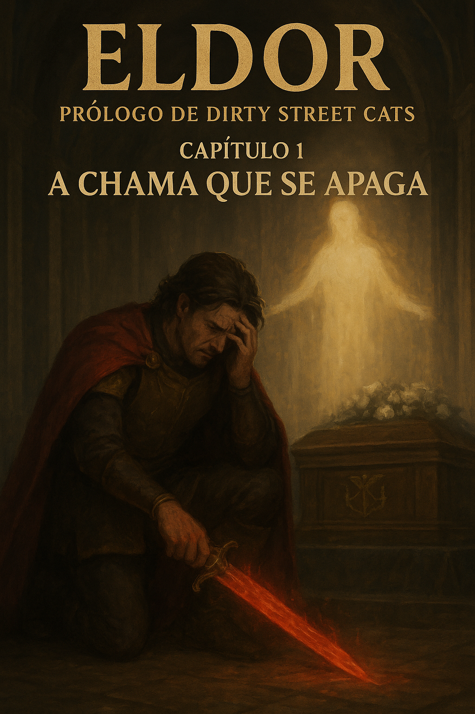

# Capítulo 1: A Chama que se Apaga — Lágrimas de um Rei sob Céu Cinzento

## Por onde começar?

Num mundo mágico e fantasioso viviam humanos, elfos, fadas e as demais raças que habitavam o mundo de Eldor, nesse mundo havia uma nação chamada Crystallis um reino próspero e abundante cujos os rios se estendiam até a nação do Leste de Eldor, e neste país havia uma cidade com o nome de Elexandria, lar de bravos guerreiros, poderosos magos, sábios astutos, e bardos que agradavam todos com suas belas melodias.

A cidade de Elexândria era governada por Hector, o rei de Crystallis. Hector era um rei bondoso e benevolente, cuidava dos pobres, ajudava as viúvas, e contribuia de forma significativa para o crescimento do reino de Crystallis, ao lado do incrível rei, havia sua esposa Catarina e seu sábio conselheiro o elfo Elandor, a paz era mais que evidente em seu reino, mas esses tempos de paz viriam a ruir.

Catarina era uma mulher doce e gentil, com o sorriso que iluminava cada manhã do rei Hector, assim como o rei Catarina era muito sensata e sábia, sabia julgar cada situação de forma precisa e imparcial, ela também era conhecida por ser uma poderosa guerreira, quase chegando a ser uma grande guerreira, com sua lança escarlate incendiava seus inimigos e os vencia com seus movimentos precisos, seus feitos nos campos de batalha eram tão notáveis quanto os do rei, eles eram conhecidos como "Os bravos ardentes".

Já Elandor era conhecido como o Grande Sábio de Crystallis, titulo dado àqueles que se dedicam ao conhecimento, os grandes sábios são responsáveis pelo equilíbrio e ordem, eles servem tanto ao Grande Criador, tanto como servem aos reis de suas respectivas nações, os grandes sábios também são uma poderosa força de contra ataque, pois dominam artes mágicas, combate de curto, médio e longo alcance, e Elandor era o mais notável dentre os 5 grandes sábios, das cinco grandes nações, não sendo apenas um estudioso, mas também um excelente estrategista, guiando o rei a rainha as suas vitórias mais esplendorosas.

## A Doença Misteriosa

Durante seu décimo quinto ano de reinado, a rainha Catarina foi afetada por uma doença grave, misteriosa como sombras da noite. Os médicos não encontravam a cura, suas faces tornando-se cada vez mais sombrias a cada dia que passava. Nem mesmo Elandor, o mais sábio do reino, sabia o que fazer. Ele passava noites em claro estudando pergaminhos ancestrais, preparando poções esquecidas, invocando magias de cura que nem mesmo os Grandes Sábios antes dele haviam dominado. Nada funcionava. Nunca tinham visto algo igual.

A febre consumia Catarina lentamente. Sua pele, outrora radiante como o sol da manhã, tornava-se pálida como pergaminho antigo. Os cabelos perdiam o brilho. As mãos que um dia empunharam a lança escarlate com vigor tremiam fracas sobre os lençóis de seda.

Mesmo com a persistência dos médicos e a força indomável da rainha, ela sucumbiu à enfermidade. Na madrugada de um dia sem lua, sua respiração cessou. Catarina, a Brasa Ardente, havia falecido.

Um silêncio pesado caiu sobre o castelo. Então, um grito, um berro animal de dor, rasgou a quietude. Hector havia compreendido.

## Dias de Luto

Foram os dias mais nebulosos em Crystallis. O céu parecia coberto por um manto cinzento perpétuo, como se o próprio Grande Criador chorasse. As ruas permaneciam vazias, sem o burburinho habitual dos mercadores, sem o riso das crianças brincando nas praças. Os súditos caminhavam cabisbaixos, vestidos de negro, sussurrando preces pela rainha que tanto amavam.

Durante o cortejo fúnebre, Elandor carregava a lança escarlate da rainha com reverência, como se carregasse uma relíquia sagrada. As chamas mágicas que um dia dançavam na lâmina haviam se apagado, deixando apenas metal frio e sem vida. Ele abaixava sua face, os olhos prateados do elfo turvos de lágrimas não derramadas, mediante a tristeza que lhe oprimia o peito como uma pedra.

Atrás dele, quatro guardas carregavam o caixão de madeira nobre, adornado com flores brancas e o brasão de Crystallis.

O rei Hector seguia atrás, cambaleando como se cada passo exigisse toda sua força. No funeral, diante da sepultura aberta, desmoronava em prantos. Cada grito e cada lágrima pareciam rasgar sua própria alma. Uma parte de si havia partido com ela, como se metade de seu coração tivesse sido arrancada do peito. Sua alegria havia sumido, substituída por um vazio tão profundo que nenhuma palavra poderia descrever.

Quando os coveiros começaram a jogar terra sobre o caixão, Hector avançou.

— Não! — sua voz saiu rouca, quebrada. — Não a levem de mim!

Elandor segurou-o pelos ombros, gentil mas firme.

— Meu rei... ela já partiu.

Ele se recusava a deixar o túmulo de sua amada, mesmo ela já tendo sido posta sob a terra. Os guardas tiveram que carregá-lo de volta ao castelo, enquanto ele murmurava o nome dela repetidamente.

## Horas Antes, no Leito de Morte

Enquanto caminhava em direção ao cemitério, aquelas horas finais atormentavam a mente de Hector, revivendo cada palavra, cada respiração, cada batida do coração dela desacelerando.

Ele lembrava:

O quarto estava mergulhado em penumbra, iluminado apenas por velas que projetavam sombras dançantes nas paredes. O cheiro de ervas medicinais misturava-se ao aroma doce e enjoativo da doença. Catarina jazia no leito real, tão frágil que parecia poder se desfazer ao menor toque.

Hector segurava sua mão, sentindo como estava fria, os dedos que um dia eram firmes e fortes agora fracos como pétalas.

Catarina abriu os olhos lentamente, aqueles olhos que ele amava, agora vidrados pela febre.

— Meu amado marido e rei, por que tu estás tão abatido?

Sua voz era um sussurro fraco, mas ainda carregava aquela doçura que sempre o desarma.

Ele apertou a mão dela, lágrimas já escorrendo.

— Como podes dizer isso, meu amor? Catarina, me aflige te ver assim, definhando diante de meus olhos, e não poder fazer nada a respeito. Enfrentei dragões, derrotei bruxos, venci batalhas impossíveis... mas contra isto, sou impotente. Agora eu te pergunto: por que tens que partir agora? Por que tu tens que me deixar sozinho neste mundo?

Catarina sorriu fracamente, erguendo a mão trêmula para tocar o rosto dele.

— Ó Hector, o que aconteceu comigo foi apenas um infortúnio, um golpe cruel do destino. Não te culpes, meu valente rei. Muito menos cair em tristeza ou amargura. Prometa-me isso.

Hector segurou a mão dela contra seu rosto, como se pudesse mantê-la ali para sempre.

— Tu estás tão linda quanto no dia em que te conheci. Lembra do dia em que nos casamos, Hector? Do juramento que fizemos diante do Grande Criador, sob as cerejeiras em flor?

Ele assentiu, incapaz de falar, a garganta apertada.

— Sim, Catarina. Juramos que estaríamos juntos até o fim... — sua voz quebrou — ...mas agora tu estás indo sem mim. Como posso continuar sem a minha outra metade? — dizia o rei enquanto chorava, o corpo sacudindo com soluços.

Catarina respirou fundo, reunindo as últimas forças que lhe restavam. Seus olhos brilharam com determinação — aquela mesma chama que ardia quando empunhava sua lança em batalha.

— Pois eu tenho mais um pedido a te fazer, meu amor. O último pedido desta vida. — ela apertou a mão dele com surpreendente firmeza. Viva meu amor. Continue, persista. Cuide de nosso povo, proteja Crystallis, sê o rei que sempre foste. É o meu último pedido.

Hector abaixou a cabeça, e suas lágrimas pingando sobre o lençol, exibiam sua amargura.

— Prometo... prometo, minha amada.

Catarina sorriu uma última vez, aquele sorriso radiante que iluminava suas manhãs.

— Então... posso partir em paz...

Sua mão afrouxou. O peito não se ergueu mais. Os olhos se fecharam, serenos como se estivesse apenas dormindo.

Por um momento interminável, Hector apenas olhou para ela, esperando, suplicando, que ela acordasse. Que fosse apenas um pesadelo.

Mas Catarina não despertou.

O grito que ele soltou naquele momento ecoou por todo o castelo e congelou o sangue de todos que o ouviram. Era o som de um coração se despedaçando.

## O Conselho de Elandor

Após o funeral, Elandor seu conselheiro e amigo, foi até seus aposentos, e lá encontrou o rei, em um estado depreciativo, então Elandor se aproximou e perguntou:

— Meu rei, sei que o senhor está abatido, mas o povo precisa do senhor.

Então Hector responde:

— Meu caro amigo, vede em que estado me encontro. Minha amada esposa faleceu, a mulher a quem jurei amor eterno diante do Grande Criador. Ainda assim, mesmo tendo zelado por ela, Ele a tomou de mim.

E Elandor responde:

— Jamais diga tal coisa meu rei! O Grande Criador jamais te faria mal, muito menos a nossa amada rainha que descanse em paz, o que houve com ela foi sim um infortúnio, mas agora ela não está mais a sofrer.

— E então o que farei? Como prosseguir sem ela?! (Dizia o rei enquanto chorava amargurado)

— Meu rei, apenas o senhor pode se reerguer, mas se me permite te dar mais um conselho, por que não fala com o Grande Criador? Sei que o senhor se sentirá melhor assim, isso é claro se o senhor quiser.

Após isso Elandor saiu dos aposentos do rei o deixando só, mas bem ele não estava totalmente só, em meio a dor e o sofrimento o rei solta um grito que estava entalado em sua garganta:

— Por que tirou ela de mim, se o Senhor é mesmo meu quero que venha e me dê uma explicação!

— Pois não…

## A Visita do Grande Criador

De repente uma voz suave se apresenta, e uma luz radiante ilumina o quarto do rei, então um ser cuja a beleza não podia ser comparada a nenhum outro surge diante dos olhos do homem que aflito estava, então o ser continuava a perguntar:

— Então rei Hector, conte-me o que te deixa tão angustiado?

O rei Hector não esboçava reação alguma a não ser, um temor cujo o qual ele nunca havia sentido, ele já havia enfrentado bruxos, necromantes, ogros e dragões, porém o rei não sentia ameaça vindo daquele ser, então o rei fica de joelhos e de cara no chão:

— Óh Grande Criador, me perdoe não era minha intenção insultá-lo, muito menos te mal dizer, mas preciso de ajuda minha amada foi tirada de mim por uma terrível doença.

— Sei que é pedir muito, mas se eu pudesse vê-la de novo, meu coração se encheria de alegria, e assim poderia seguir em frente.

Então o Grande Criador respondeu:

— Não poderás vê-la, pois uma vez partindo deste mundo, ela não pode retornar, isso é indiscutível, após a morte aqueles que reconheceram o meu amor e minha bondade estarão no reino celestial, Catarina serviu bem o seu propósito e agora pode descansar em paz, então não entristeças mais o teu coração Hector, ela está bem.

Hector ao ouvir as palavras do Grande Criador, começa a chorar novamente, e embora a dor ainda estivesse ali, seu coração era tomado por uma paz sublime, então Hector se levanta, vai até o banheiro e se lava, e vai dormir, no dia seguinte ele solicita a presença de Elandor em seu gabinete e avisa que fará um pronunciamento real diante do povo.

— Elandor, mande todos se reunirem na praça, irei fazer um pronunciamento.

— Sim meu rei. (Respondeu Elandor)

## O Pronunciamento

Então na praça de Elexandria o povo se reúne, estão ali nobres e plebeus, os intelectuais e os astutos, então o rei Hector e o Grande Sábio Elandor aparecem caminhando até o palanque, ambos estavam em silêncio, ao subir no palanque e estar diante do povo o rei começa a falar:

— Meus leais súditos, como vocês sabem faz mais de uma semana que nossa rainha nos deixou, eu estava em um profundo luto e desespero, mas eu tive uma visão e percebi, que não podemos parar aqui e nos afundar na tristeza, devemos nos reerguer lutar, para que o esforço da nossa rainha não tenha sido em vão, pois ela não gostaria de nos ver tristes, então cidadãos de Elexandria, vamos homenagear nossa rainha com nossos sorrisos e nossa alegria, pois era assim que ela gostaria de no ver.

Então o povo começava a sorrir e saltar de alegria dizendo:

— Que a nossa rainha de onde quer que ela esteja que ela veja nossos sorrisos e que o Grande Criador nos proteja!