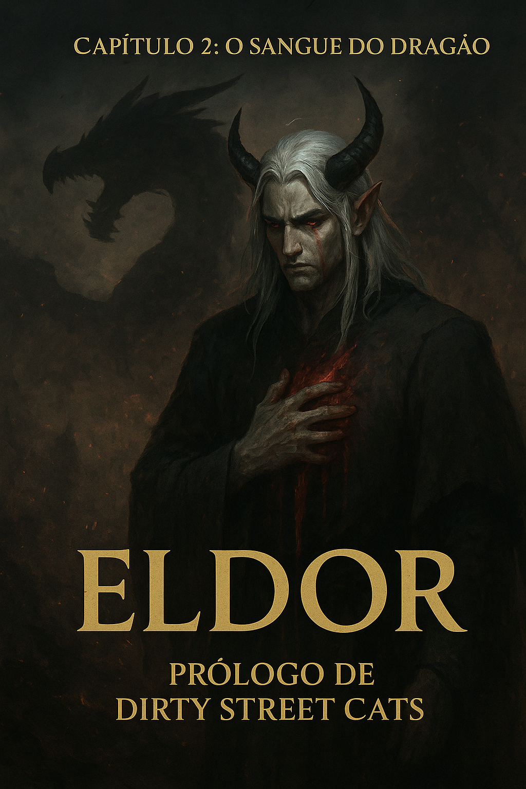

# Capítulo 2: O Sangue do Dragão — Sombras que Marcham sob as Cinzas de Wyvernia

A paz parecia ter retornado. Porém, o reino que estava no centro do mundo de Eldor, e toda Eldor estava prestes a ser ameaçado. Na nação do Sul, Wyvern é governada pelos draconideos uma raça híbrida, meio-humanos e meio-dragões. Essa raça surgiu quando o grande dragão negro Agrion foi vencido pelo celestial Yeron, um guerreiro formidável. A vitória era evidente, mas a queda do dragão fez a terra adoecer, e o sangue do dragão havia escorrido para os rios que levavam até a capital da nação de Wyvernia, a cidade Drakewood. Então, a população, desconhecendo o perigo, bebeu da água impura e em pouco tempo, todos já haviam sido contaminados pela maldade de Agrion. Os draconideos começaram a usar a magia de forma maligna, atacando vilas vizinhas até dominarem toda a nação de Wyvernia. Entre os draconideos, destacavam-se o quarto Grande espadachim Windstrom e a quarta Grande maga Elisia.

Windstrom era proeminente em usar o poder dos ventos, já Elisia usava a magia de fogo como ninguém. Juntos, eles eram chamados de "A Tempestade Flamejante". Ao saber que a rainha do reino de Crystallis havia morrido, pensaram em atacar o reino ao saber da baixa, porém eles subestimaram um detalhe crucial: O Grande Sábio Elandor, o elfo e mais poderoso estrategista do reino de Eldor.

Os draconideos do reino de Wyvernia, eram conhecidos por sua brutalidade e selvageria, pois a natureza brutal e maligna de Agrion havia contaminado seu ser. Contudo, entre os draconideos, estava um elfo de pele pálida, chifres negros e olhos vermelhos de aparência magra, seu nome era Urok, o terceiro sábio na ordem das cinco nações.

## As Cinco Nações de Eldor

Para aqueles que desconhecem o reino de Eldor é dividido por cinco nações, a primeira nação, no centro do mundo Crystallis, habitada por humanos e elfos. A nação do sul, dominada pelos draconideos, a terra das cinzas Wyvernia. A nação do leste, onde abundam árvores de cerejeira, um lugar onde os humanos e a natureza se conectam de forma sublime, essa nação é chamada de Serin Rando. Ao norte de Eldor, onde as nevascas cobrem o horizonte e onde apenas os mais fortes sobrevivem, o lar de guerreiros tão fortes quanto os gigantes, este lugar se chama Frygid. A nação do Oeste, terra onde elfos, fadas e druidas vivem, governada pelo nobre rei elfo Baldur com sabedoria e justiça, todos nessa nação são felizes e harmoniosos, mas como um elfo como Urok se tornou um draconideo?

Para essa resposta precisamos voltar para a queda do dragão Agrion.

## A Queda de Agrion

### Há quinze anos, no mesmo ano em que Hector foi coroado rei:

Quando o celestial Yeron havia golpeado o terrível dragão, sua espada flamejante corta o torso até chegar ao coração, partindo-o no meio. Urrando de dor, Agrion caiu e desfaleceu. Como citado antes, sua queda fez a terra estremecer e adoecer. Por um azar do destino, um elfo estava a peregrinar por aquele lugar. Ao escutar o estrondo o curioso elfo foi correndo até o local. Chegando lá, o elfo cujo nome era Urok, viu o corpo do dragão.

Avistando a fera e sabendo do que se tratava, Urok tentou correr, mas o dragão mesmo próximo da morte, estendeu seus braços e, com suas garras pega o pequeno elfo:

— Você servirá ao meu propósito.

Após dizer estas palavras o dragão abre a boca o elfo derramando seu sangue na boca de Urok, forçando-o a engolir o sangue. Então, Urok é derrubado e começa a agonizar no chão, a terrível substância começava a modificar o corpo: suas unhas se transformaram em garras; seus olhos azuis que mostravam serenidade, de repente tomaram um tom escarlate e mostravam ódio e fúria; e chifres negros começaram a sair de sua testa. Aquele não era mais Urok, Agrion já havia tomado seu corpo e aprisionado sua alma.

— Então é assim que é um corpo de um elfo… Uma enorme afinidade com a mana. É diferente de possuir um humano que tem afinidade maior com a cinese. Aparentemente esse tal de Urok, tem irmãos, Baldur e … - Ha ha ha! Que formidável! Que esplêndido! Ele é irmão do sábio mais poderoso deste mundo, talvez seja mais divertido visitar este irmão. Me pergunto como o desgosto estará estampado em sua face, ao ver que seu irmão se transformou em uma aberração.

Agrion retornou ao cadáver colossal que um dia fora seu corpo de dragão. Com as garras afiadas, retalhou sua carcaça ordinária, rasgando escamas milenares, e rompendo veias que outrora carregaram fogo. E então, com as lágrimas negras de uma besta nefasta e moribunda, seu sangue escorreu em torrentes até o rio, levando consigo a maldição que transformaria Wyvernia para sempre.

## Quinze Anos Depois

O tempo passou, quinze longos anos. Como sementes plantadas em solo fértil, a contaminação floresceu. Cada casa, cada rua, cada viela, todas as cidades renderam-se à influência do dragão. Um a um, inexoravelmente, todos os humanos foram transformados em draconídeos. O que antes era jardim tornou-se deserto; onde havia alegria e paz, agora reinavam cinzas e discórdia.

E Agrion, o antigo dragão aprisionado em carne élfica, dava passos lentos mas mortais assim como um câncer, silencioso e letal, corroía as estruturas de Eldor. Cada movimento calculado, cada peça posicionada no tabuleiro da guerra. Seu objetivo final brilhava no horizonte como uma joia esperando para ser arrancada: Crystallis, o coração de Eldor, agora sangrando sem sua rainha.

## O Aviso Divino

E enquanto Agrion avançava, Elandor preparava o reino de Crystallis para a ameaça vindoura. O Grande Sábio havia sido alertado pelo Grande Criador, que o visitara em um sonho.

Na escuridão daquela noite, uma voz ecoou em sua mente, de forma suave, porém impossível de ignorar:

— Erga-te Elandor.

O elfo despertou, mas não estava mais em seu quarto. Estava no monte mais alto de Eldor, o Pico Celestial, diante da gloriosa presença do Grande Criador.

— Ó Grande Criador, a que devo a honra de escutar Tua voz? (Perguntou Elandor de joelhos)

— Uma grande ameaça está para afrontar a nação de Crystallis, e posteriormente trará a destruição, Agrion o dragão maligno que uma vez afrontou os céus, possuiu o corpo de um Grande Sábio, tomando-o à força, e contaminou a nação de Wyvernia, agora ele tem um exército à sua disposição e marchará contra as outras quatro nações.

— E como nós vamos contra atacar? Como poderemos enfrentar tal inimigo?

— Vocês lutarão. Vocês vencerão. Mas haverá baixas.

Elandor despertou sobressaltado, suor frio escorrendo pela testa. Embora quisesse perguntar mais, quem era o Grande Sábio que havia sucumbido à maldade de Agrion? Quem era aquele que precisava ser salvo? — A visão já havia se dissolvido. As respostas não viriam. Não ainda.

O elfo levantou-se e caminhou até a janela, olhando para o horizonte sul. Pela vidraça, a lua ainda brilhava sobre Elexandria adormecida. Tudo parecia em paz. Mas não era.

No ar, havia algo diferente, um pressentimento, um peso sombrio que não estava lá antes. Como uma sombra se aproximando, invisível mas inegável.

— Agrion... — murmurou, a voz carregada de certeza sombria.

— Ele está vindo.

Elandor cerrou os punhos, os olhos esmeralda brilhando com determinação férrea.

— Aquele dragão maldito marcha sobre Eldor para trazer destruição.

Virou-se da janela, a decisão tomada.

— Não há mais tempo a perder. É hora de preparar os guerreiros!

## A Convocação

Na mesma noite, próximo à madrugada, Elandor se dirigiu aos aposentos do rei Hector. Os guardas noturnos ficaram surpresos ao ver o Grande Sábio acordado àquela hora.

— Desejo uma audiência com os capitães e o rei. Imediatamente!

— Mas, senhor, o rei...

— Digam-lhe que o reino está sob ameaça. — Elandor os cortou, os olhos prateados brilhando com urgência. — Não. Toda Eldor está sob ameaça!

Os guardas trocaram olhares breves, reconhecendo a gravidade na voz do Grande Sábio. Então se dividiram: um correu até os alojamentos dos capitães, enquanto o outro seguiu apressado para acordar o rei.

O guarda mais jovem correu pelos corredores até os alojamentos dos capitães, batendo em cada porta com urgência. Um a um, os líderes militares de Crystallis emergiram — alguns ainda ajustando armaduras, outros esfregando o sono dos olhos, mas todos reconhecendo a gravidade no rosto do mensageiro.

Enquanto isso, o guarda mais velho respirou fundo diante da porta dos aposentos reais. Sabia que o rei havia dado ordens explícitas para não ser perturbado durante a noite, ainda mergulhado no luto pela rainha.

Bateu na porta. Uma vez. Duas vezes.

— Meu rei? — chamou, a voz hesitante. — Perdoai a intrusão, mas... é urgente.

Silêncio.

Então, uma voz rouca, carregada de dor mal curada:

— Disse que não queria ser incomodado.

— Meu rei, o Grande Sábio Elandor convocou uma reunião de guerra. Ele diz que o reino está sob ameaça. Que toda Eldor está sob ameaça.

Uma pausa longa. O guarda quase pensou que o rei não responderia. Mas então ouviu passos do outro lado. A porta se abriu.

Hector estava diante dele, ainda vestindo roupas simples de dormir, os olhos vermelhos de noites mal dormidas. Mas havia algo diferente ali — uma centelha, fraca mas presente, que não se via desde o funeral.

— Elandor disse isso? — Sua voz estava mais firme agora.

— Sim, Vossa Majestade. Ele aguarda no Salão de Guerra com os capitães.

Hector olhou para trás, para o quarto vazio onde outrora Catarina dormia ao seu lado. Então, como se tivesse tomado uma decisão que vinha adiando há semanas, virou-se para o guarda.

— Diga ao Grande Sábio Elandor que estarei lá em instantes. E convoque meu escudeiro, pois preciso me vestir adequadamente.

— Sim, meu rei!

O guarda se curvou e saiu apressado. Hector fechou a porta e caminhou até o espelho. Olhou para seu reflexo — um homem destroçado, envelhecido pelo luto. Mas então seus olhos pousaram sobre a armadura pendurada na parede. A armadura escarlate que vestira ao lado de Catarina em tantas batalhas.

"Viva e cuide de nosso povo", lembrou Hector sobre o que sua esposa havia pedido.

— Vou honrar tua memória, meu amor. — Sussurrou para o quarto vazio. — Eu prometo.

## O Salão de Guerra

Minutos depois, o Salão de Guerra estava repleto. Tochas iluminavam o recinto circular de pedra, onde uma grande mesa de carvalho dominava o centro. Sobre ela, um mapa detalhado de Eldor mostrava as cinco nações — Crystallis no centro, Wyvernia ao sul, Serin Rando ao leste, Frygid ao norte, e o reino élfico do oeste.

Ao redor da mesa, os cinco capitães aguardavam em silêncio.

**Argus, o Vendaval de Prata**, capitão dos magos de batalha. Alto e forte, seus longos cabelos prateados flutuavam levemente mesmo sem vento, como se a própria mana dançasse ao seu redor. Seus olhos azuis intensos observavam tudo com curiosidade analítica.

**Haran, a Sombra da Noite**, líder dos ladinos. Encostado na parede mais escura do salão, quase invisível mesmo sob a luz das tochas. Seu rosto permanecia oculto sob o capuz negro, revelando apenas olhos astutos que tudo observavam em silêncio.

**Visenya, a Flecha Esmeralda**, capitã dos arqueiros. Mulher de meia-idade com cabelos ruivos trançados e cicatrizes de guerra em suas costas. Checava a tensão da corda de seu arco longo mesmo ali, seus olhos verdes examinando o mapa com precisão tática.

**Elisa, a Velocista de Ouro**, princesa de Crystallis e Grande Espadachim, capitã dos espadachins. Jovem, com cabelos loiros presos em rabo de cavalo alto e olhos azuis, vestia armadura leve que permitia movimento rápido. Suas mãos descansavam naturalmente sobre as duas espadas curvas em sua cintura.

E por fim, **Hugo Walterson, o Forjamartelo**, Segundo Grande Sábio de Crystallis. Homem robusto, com barba ruiva espessa e braços marcados por runas brilhantes — cicatrizes de poder gravadas em sua carne. Suas mãos calejadas de décadas na forja tamborilavam impacientes na mesa.

Elandor permanecia em pé ao lado da cabeceira da mesa, onde uma cadeira vazia aguardava o rei.

A porta se abriu.

O rei Hector entrou, e todos se viraram. O rei vestia suas vestes reais — o manto escarlate sobre armadura de prata polida, a coroa de ouro sobre a testa. Parecia mais magro que antes, os olhos ainda carregando sombras de luto, mas havia determinação e coragem em seus passos.

— Meu rei. — Elandor se curvou levemente.

Os capitães o imitaram em uníssono.

— Todos podem se sentar.

— Começaremos a reunião para contra atacar Agrion.